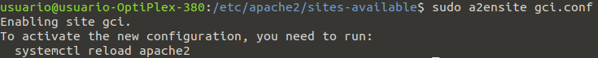

<!-- omit in toc -->

# Documentación Apache

Luis Ferrer Manero

<br>


<br>

<!-- omit in toc -->

## Resumen

Vamos a realizar la instalación y configuración de un servidor Apache en un sistema operativo Ubuntu, además de la configuración del archivo VirtualHost para redireccionar una url seleccionada hasta una página web básica que creamos nosotros y guardamos en el servidor.

<br>

<!-- omit in toc -->

## Palabras clave

- Apache
- Linux
- Servidor
- Cliente
- HTTP
- LAN
- Conexión local
- Internet

<br>

<!-- omit in toc -->

## Índice

- [Introducción](#introducción)
  - [Contexto](#contexto)
  - [Motivación](#motivación)
- [Instalación y Configuración](#instalación-y-configuración)
  - [Paso 1: Instalar Apache](#paso-1-instalar-apache)
  - [Paso 2: Ajustar el Firewall](#paso-2-ajustar-el-firewall)
  - [Paso 3: Comprobar el servidor web](#paso-3-comprobar-el-servidor-web)
  - [Paso 4: Administrar el proceso de Apache](#paso-4-administrar-el-proceso-de-apache)
- [Creación de nuestra propia web](#creación-de-nuestra-propia-web)
  - [Paso 1: Crear la carpeta y el archivo html](#paso-1-crear-la-carpeta-y-el-archivo-html)
  - [Paso 2: Configurar el archivo _VirtualHost_](#paso-2-configurar-el-archivo-virtualhost)
  - [Paso 3: Activar el archivo _VirtualHost_](#paso-3-activar-el-archivo-virtualhost)
- [Bibliografía](#bibliografía)

<br>

## Introducción

### Contexto

El proyecto se ha realizado en la academia Ágil Centros, durante la realización del segundo curso del Grado Superior de Diseño de Aplicaciones Web.

El entorno que vamos a utilizar es el servidor **_Apache HTTP_**, también llamado **_Apache_**, es un servidor web _HTTP_ de código abierto para la creación de páginas y servicios web. Es un servidor multiplataforma, gratuito, muy robusto y que destaca por su seguridad y rendimiento desarrollado dentro del proyecto HTTP Server (httpd) de la [_Apache Software Foundation_](https://www.apache.org/). Todo el trabajo se va a realizar en un sistema operativo **Ubuntu**.

<br>

### Motivación

Este proyecto se realiza para aprender qué son los servidores **_Apache_**, cómo funcionan y cómo utilizarlos para poder desplegar páginas web.

<br>

## Instalación y Configuración

<br>

### Paso 1: Instalar Apache

Apache puede instalarse con las herramientas convencionales de instalación de paquetes, ya que está disponible en los repositorios de software predeterminados de Ubuntu.

El primer paso es actualizar el índice de paquetes locales:

```
$ sudo apt update
```

Y, a continuación, instalar el paquete **_apache2_**:

```
$ sudo apt install apache2
```

Con lo que se instalará Apache y todas la dependencias necesarias.

<br>

### Paso 2: Ajustar el Firewall

Antes de probar Apache, necesitamos modificar los ajustes de firewall para permitir el acceso externo a puertos web predeterminados. En el sistema operativo debería tener un firewall UFW (_Uncomplicated Firewall_) configurado para rentringir el acceso a su servidor, en el que Apache se registra durante la instalación par aproporcionar perfiles de aplicación que se pueden utilizar para habilitar o deshabilitar acceso a Apache a través de firewall.

Primero tenemos que enumerar los perfiles de aplicación UFW:

```
$ sudo ufw app list
```

Que nos muestra una lista como esta:


Donde vemos que hay tres perfiles disponibles para Apache:

- **Apache**: abre el puerto 80 (tráfico web normal no cifrado)
- **Apache Full**: abre el puerto 80 (tráfico web normal no cifrado) y el puerto 443 (tráfico TLS/SSL cifrado)
- **Apache Secure**: abre solo el puerto 443 (tráfico TLS/SSL cifrado)

Se recomienda habilitar el perfil más restrictivo, pero como no vamos a configurar SSL para nuestro servidor, solo debemos permitir el tráfico en el puerto 80:

```
$ sudo ufw allow 'Apache'
```

Podemos verificar el cambio con el comando:

```
$ sudo ufw status
```

<br>

### Paso 3: Comprobar el servidor web

Al final del proceso de instalación, Ubuntu inicia Apache, por lo que el servidor ya debería estar activo.

Podemos comprobar si el servidor se encuentra en ejecución con el comando:

```
$ sudo systemctl status apache2
```

O solicitando una página de Apache.

Para acceder a la página de destino predeterminada de Apache necesitamos nuestra dirección ip, que podemos obtener escribiendo en la línea de comandos del servidor el comando:

```
$ hostname -I
```

Con la dirección IP del servidor, la introducimos en el navegador:

```
http://server_ip
```

Y podemos encontrarnos la página web predeterminada de Apache, que indica que funciona correctamente y donde podemos encontrar información básica sobre archivos y ubicaciones de directorios importantes de Apache.

<br>

### Paso 4: Administrar el proceso de Apache

Ahora que el servidor web está listo y en funcionamiento, podemos ver algunos comandos de administración básicos.
Para detener el servidor web:

```
$ sudo systemctl stop apache2
```

Para iniciar el servidor web:

```
$ sudo systemctl start apache2
```

Para detener y volver a iniciar el servidor:

```
$ sudo systemctl restart apache2
```

Para recargar el servidor sin cerrar conexiones, útil se se hacen cambios de configuración:

```
$ sudo systemctl reload apache2
```

Por defecto Apache está configurado para iniciarse automáticamente cuando se inicia el servidor, si no es lo que se quieres lo podemos dehabilitar con:

```
$ sudo systemctl disable apache2
```

Para volver a habilitar este servicio:

```
$ sudo systemctl enable apache2
```

<br>

## Creación de nuestra propia web

### Paso 1: Crear la carpeta y el archivo html

Por defecto, Apache tiene una página web básica, vista en el paso anterior. La podemos localizar en `/var/www/html/index.html`, y su configuración en el archivo de _Virtual Host_ en `/etc/apache2/sites-enabled/000-default.conf`.

Modificando el archivo de _Virtual Host_ podemos tener múltiples páginas web en el mismo servidor.

Vamos a hacer que la configuración del host virtual apunte a `www.example.com` y configurar nuestro propio `gci.example.com`.

El primer paso es crear una carpeta para nuestra página web:

```
$ sudo mkdir /var/www/gci/
```

Aqui le damos el nombre de gci a nuestra carpeta pero cualquier nombre vale siempre que después apuntemos a ella en la configuración.

Entramos en la carpeta y creamos el archivo html que vamos a usar:

```
$ cd /var/www/gci/
$ sudo nano index.html
```

E introducimos el siguiente código en el archivo **_index.html_**:

```
<html>
   <head>
      <title> Ubuntu rocks! </title>
   </head>
   <body>
      <p> I'm running this website on an Ubuntu Server server!
   </body>
</html>
```

<br>

### Paso 2: Configurar el archivo _VirtualHost_

Empezamos dirigiéndonos a la carpeta del archivo de configuración:

```
$ cd /etc/apache2/sites-available/
```

Como Apache tiene el archivo de configuración por defecto, vamos usar este archivo como punto de inicio y le cambiamos el nombre a `gci.conf` para que coincida con el nombre del subdominio:

```
$ sudo cp 000-default-conf gci.conf
```

Abrimos el archivo para editarlo:

```
$ sudo nano gci.conf
```

Deberíamos tener nuestro email para que los usuarios nos peudan contactar en caso de que Apache tenga algún error:

```
ServerAdmin yourname@example.com
```

También queremos que la directiva `DocumentRoot` señale al directorio donde tenemos nuestros archivos:

```
DocumentRoot /var/www/gci/
```

La última directiva a añadir es el nombre del servidor con la url elegida:

```
ServerName gci.example.com
```

Además, necesitamos modificar el archivo `/etc/hosts` y añadir al final del archivo la dirección ip que apunte al servidor, para que acceda a los archivos de la web, y la url seleccionada que queremos que redireccione a nuestra web:

```
127.0.0.1 gci.example.com
```

Esto asegura que los usuarios llegan a esta página en vez de la página por defecto de Apache cuando acceden a `gci.example.com`.

### Paso 3: Activar el archivo _VirtualHost_

Después de configurar nuestra página web, necesitamos desactivar el archivo de configuración de _VirtualHost_:

```
$ sudo a2dissite gci.conf
```

Y activarlo de nuevo:

```
$ sudo a2ensite gci.conf
```

Obteniendo el siguiente resultado:  


Como nos indica en el resultado obtenido al ejecutar el comando, necesitamos recargar Apache para que se aplique el cambio de configuración del servidor:

```
$ systemctl apache2 reload
```

Ahora podemos poner la dirección url `gci.example.com` en el navegador para acceder a nuestra página web:


<br>

## Bibliografía

[Apache HTTP Server: ¿Qué es, cómo funciona y para qué sirve?](https://www.ibxagency.com/blog/apache-http-server-que-es-como-funciona-y-para-que-sirve/)

[Cómo instalar el servidor web Apache en Ubuntu 20.04](https://www.digitalocean.com/community/tutorials/how-to-install-the-apache-web-server-on-ubuntu-20-04-es)

[Install and configure Apache](https://ubuntu.com/tutorials/install-and-configure-apache#1-overview)

[¿Qué son y cómo emplear los VirtualHost en Apache?](https://www.desarrollolibre.net/blog/apache/que-son-y-como-emplear-los-virtualhost-en-apache)
